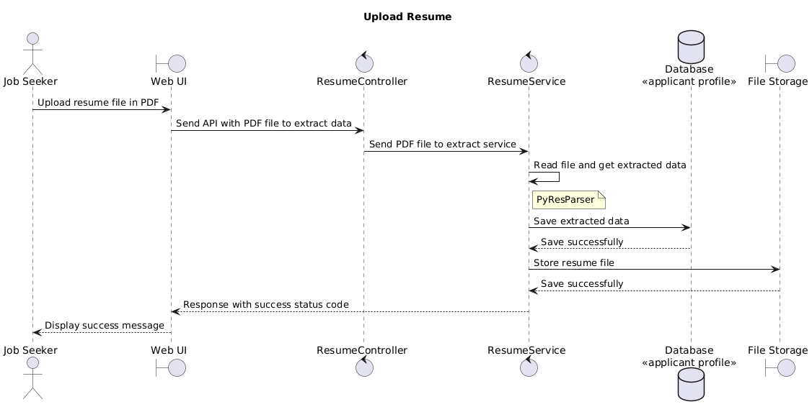
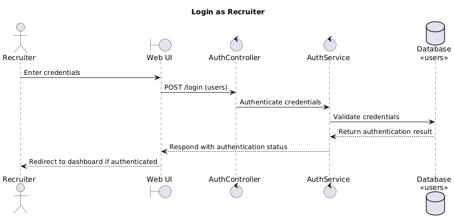
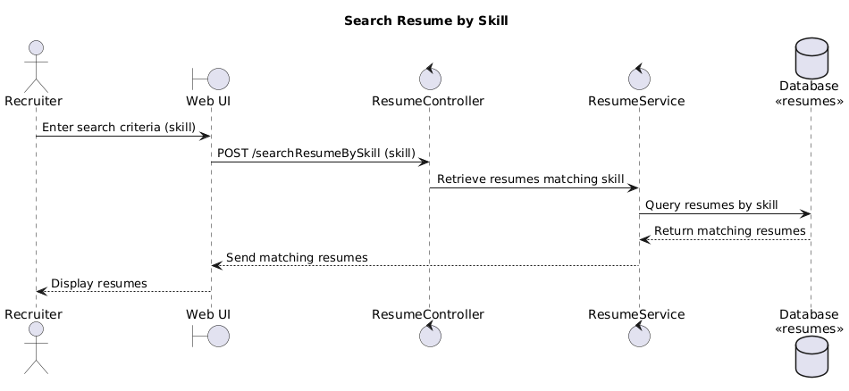

# Technical Documentation

## Table of Contents
1. [Functional Requirements Specification](#functional-requirements-specification)
    - [Stakeholders](#stakeholders)
    - [Actors and Goals](#actors-and-goals)
    - [User Stories](#user-stories)
    - [Use Cases](#use-cases)

2. [System Design](#system-design)
    - [System Architecture](#system-architecture)
    - [Sequence Diagram](#sequence-diagram)
    - [Tech Stack](#tech-stack)
    - [Database Design](#database-design)
    - [API Specification](#api-specification)

## Functional Requirements Specification

### Stakeholders

- **Job Seekers**: Users who upload their resumes to be parsed.
- **Recruiters**: Users who view and search the structured resume data for hiring purposes.
- **Developers**: Individuals responsible for developing and maintaining the system.

### Actors and Goals

- **Job Seekers**:
    - Create own account for job application.
    - Upload resume files in PDF format to the system.
    - View and edit parsed resume data.
    
- **Recruiters**:
    - Create own account for hiring process.
    - Search and filter applicant information and parsed resumes.
    - View structured resume information.

- **Developers**:
    - Implement and update system features.
    - Fix bugs and ensure system stability.

### User Stories

- Job Seeker

    - As a job seeker, I want to register an account so that I can log in to the system.
    - As a job seeker, I want to log in to the system so that I can upload my resume.
    - As a job seeker, I want to upload my resume so that it can be parsed and structured.
    - As a job seeker, I want to view my parsed resume data so that I can ensure its accuracy.

- Recruiter

    - As a recruiter, I want to log in so that I can access candidate information.
    - As a recruiter, I want to view structured data of each resume so that I can easily evaluate candidates.
    - As a recruiter, I want to search for resumes by skill so that I can find candidates with specific qualifications.
    - As a recruiter, I want to get names and emails of candidates who can do [JavaScript] so that I can contact them for job opportunities.

### Use Cases  

- Job Seeker

    - **Register Account as Job Seeker**

        - Actor: Job Seeker
        - Description: User creates a new account as a job seeker on the website.
        - Pre-condition: User is not logged in.
        - Post-condition: Job seeker account is created and logged in.

    - **Login as Job Seeker**

        - Actor: Job Seeker
        - Description: User logs in to their account on the website.
        - Pre-condition: User has registered and has a valid job seeker account.
        - Post-condition: User is authenticated and logged in to the system.

    - **Upload Resume**

        - Actor: Job Seeker
        - Description: User uploads their resume file in PDF format.
        - Pre-condition: User is logged in.
        - Post-condition: Resume file is uploaded and parsed.

    - **View Parsed Resume**

        - Actor: Job Seeker
        - Description: Job seeker views the structured data extracted from the resume.
        - Pre-condition: Resume file is uploaded and parsed.
        - Post-condition: Structured data extracted from the resume is displayed.

- Recruiter

    - **Login as Recruiter**

        - Actor: Recruiter
        - Description: Recruiter logs in to their account on the website.
        - Pre-condition: User has registered and has a valid recruiter account.
        - Post-condition: User is authenticated and logged in to the system.

    - **View Applicant Profile by Each Resume**

        - Actor: Recruiter
        - Description: Recruiter views the structured data extracted from each resume.
        - Pre-condition: Parsed resume data exists in the system.
        - Post-condition: Structured data for the selected resume is displayed.
        
    - **Search Resume by Skill**

        - Actor: Recruiter
        - Description: Recruiter searches for resumes based on specific skills.
        - Pre-condition: Parsed resume data exists in the system.
        - Post-condition: Relevant resumes matching the search criteria are displayed.

## System Design

### System Architecture

### Sequence Diagram

- Job Seeker

    - **Register Account as Job Seeker**

        

    - **Login as Job Seeker**

        

    - **Upload Resume**

        

    - **View Parsed Resume**

        

- Recruiter

    - **Login as Recruiter**

        

    - **View Applicant Profile by Each Resume**

        

    - **Search Resume by Skill**

        

### Tech Stack
### Database Design
### API Specification